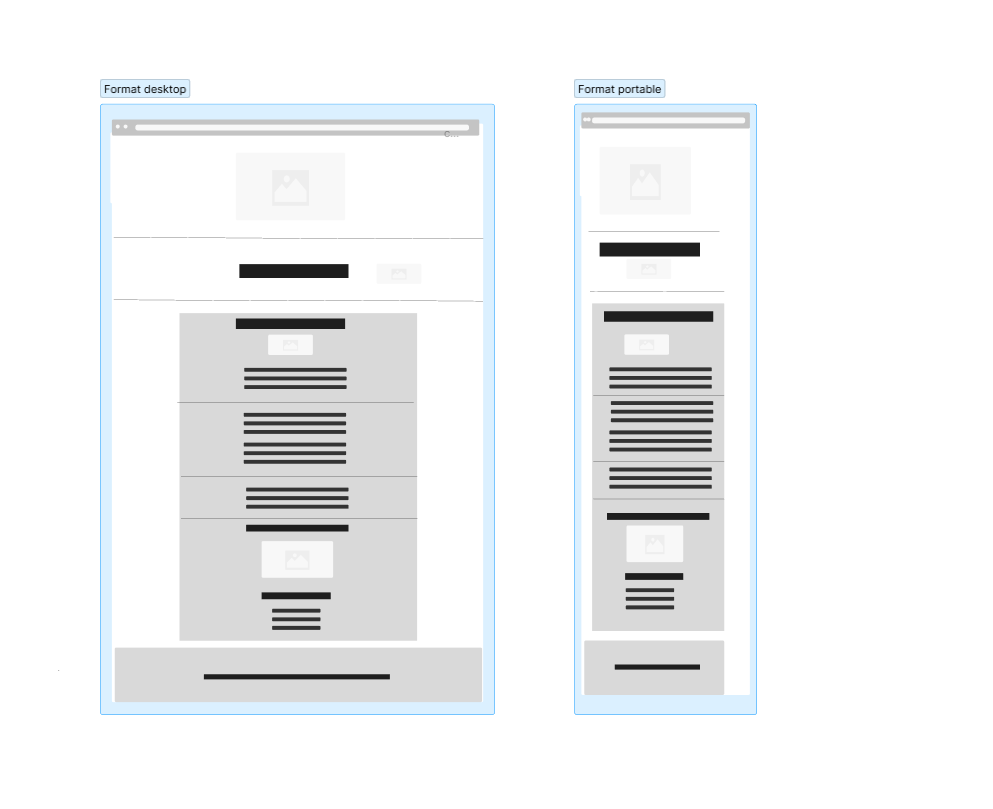

# KS FACTORY

 

# CONTEXTE 

Site fictif dans les energies petrolieres.

# FONCTIONNALITES

## dans le header 

- Un logo qui restera statique qui sera central

## Dans le main 

` section une :` 

* Présentation et son logo avec son <h2> est son image 
* Définition de l entreprise dans un 

* d'un aside explicatif en lorem 
* realisation d'une separation 
* un background gris clair #EEE;

`section deux:`

* Realiser trois liens 
* Au survol il doivent changer de couleur

`section trois:`

* Il y aura un titre <h2>
* Avec un image  
* titre <h3>
* text descriptif avec une figcaption

## Dans le Footer 

* paragraphe simple 

# CONTRAINTES TECHNIQUES

- Aucun élément n'est coupé et le texte a une taille suffisante quelle que soit la taille
  du médium.
- Version portable, tablette, pc
- J'ai fait le logo sur `canvas`
- Configurer les requêtes médias
- Style de police :`Oswald`.
- les images:[images](https://fr.freepik.com/photos-gratuite/)

# ENVIRONNEMENT DEVELOPPEMENT

- Code Visual Studio
- J'ai également versionné mon code avec Git et GitHub. Vous trouverez le dépôt [ksfactory](https://github.com/karine-schobert/ksfactory)

# DECOUPAGE DES MAQUETTES 

1. Réalisation de maquettes au format portable, portable avec [FIGMA](https://www.figma.com/fr/)
1. Rassemblez des ressources (images, icônes, polices)
2. Définition de la structure HTML du site pour qu'elle soit propre et cohérente
3. Intégration des différentes parties : Header, main, footer
4. Rédaction de CSS (en utilisant flexbox) et implémentation de points d'arrêt
6. Ce projet a été imaginé de A à Z

## DIFFICULTEES RENCONTREES 

- Mise en place du html en respectant la sémantique et utiliser les bonnes `<balises>`
- Mise en place du CSS ses classes pour essayer de respecter la méthode Bem 
- Mise en place du responsive avec ses medias-Queries

## Evolution du projet 

- Mettre sur l'encart Acceuil un lien pour une redirection 
- Ameliorer le footer en ajoutant les réseaux sociaux , un lien contact 

## VOS SUGGESTIONS

Je suis en formation chez Oclock, n'hésitez pas à me faire part de vos suggestions